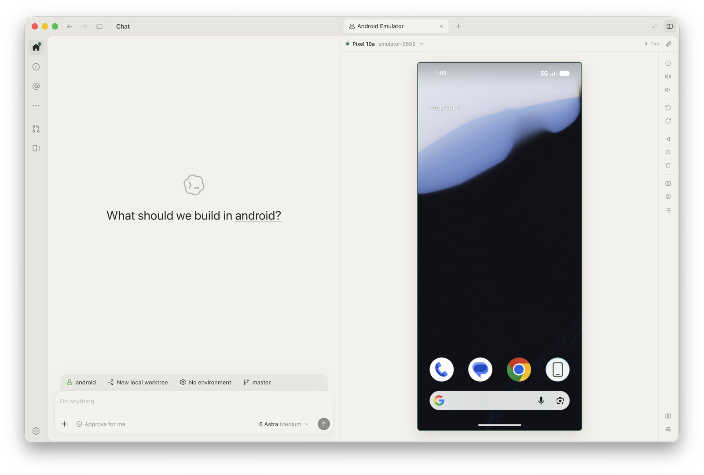
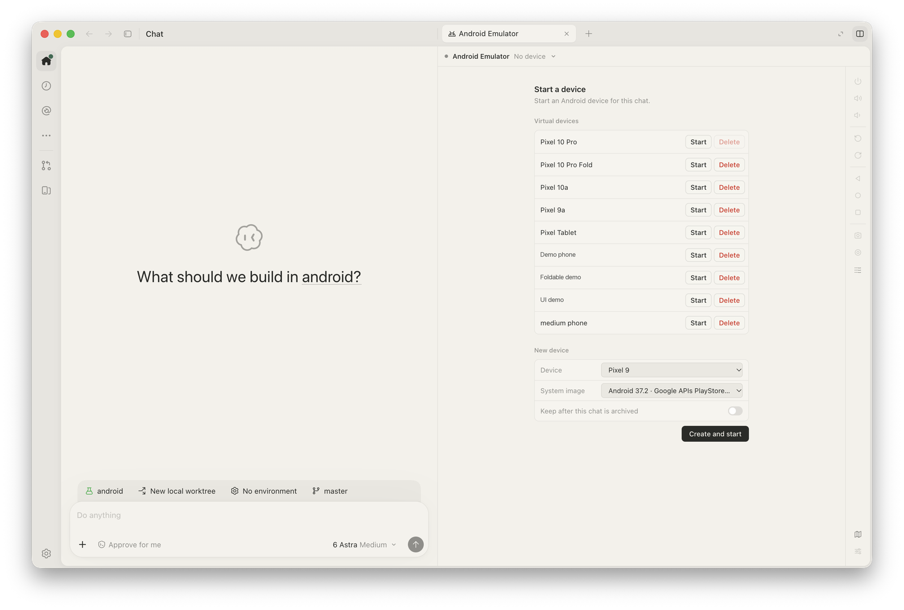
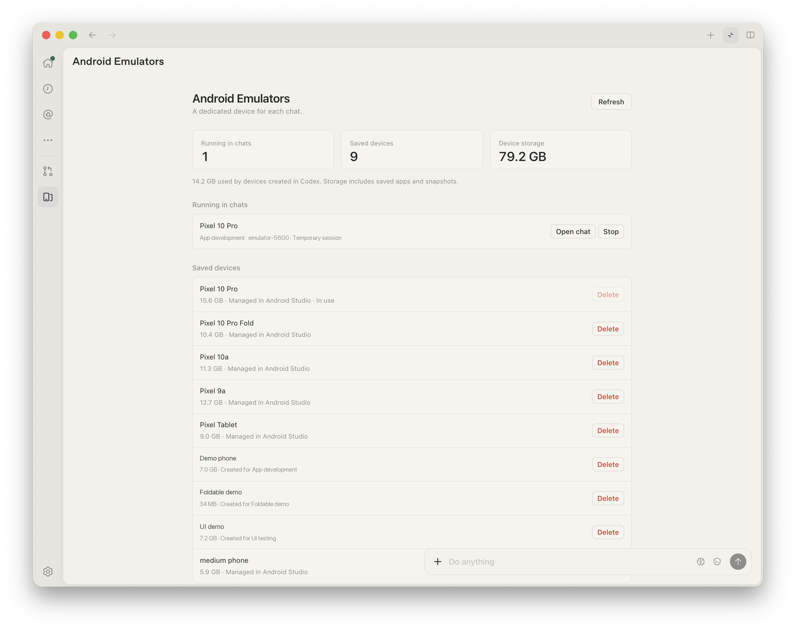

# Android Emulator Plugin

Run, control, and test Android apps from Codex. Pin emulators and connected Android devices to a chat, then watch the agent work or take control in the live panel.



<table>
  <tr>
    <th>Start or create a device</th>
    <th>Manage devices across chats</th>
  </tr>
  <tr>
    <td><a href="assets/screenshots/device-setup.png"></a></td>
    <td><a href="assets/screenshots/device-manager.png"></a></td>
  </tr>
</table>

<sub>Screenshots use example chat names, device names, and app icons.</sub>

## Features

- **Exclusive devices per chat:** pin multiple emulators or connected Android devices for before/after testing. Each device belongs to one chat; moving a connected device to another chat requires confirmation.
- **Compare devices:** switch between device tabs or drag one tab onto another to view both side by side. Hidden tabs pause their streams.
- **Live controls:** tap, swipe, type, rotate, adjust volume, and change foldable posture.
- **Agent tools:** inspect screenshots and UI elements, target controls by name, enter text, and wait for screen changes.
- **App testing:** install APKs, open apps and links, manage permissions, and change device conditions such as dark mode, font size, location, and battery level.
- **Debugging and capture:** read Logcat, diagnose connection problems, capture screenshots, record video, and copy captures to the clipboard or add them to chat.
- **Screen memory:** automatically remember screens and routes as the agent uses an app. Return to a saved destination from the Screen map panel.

The **Android Emulators** sidebar manages running devices and saved virtual devices. Multiple views of a device share its video encoder; hidden panels pause streaming while the emulator remains available to the agent.

## Requirements

- Codex desktop with plugin support.
- Android SDK Platform Tools on macOS or Linux. Virtual devices also need Android SDK Emulator and a system image. Android Studio can install these through SDK Manager.
- Node.js 20 or newer. The plugin uses Codex's bundled runtime when available.

Use an existing Android Virtual Device or ask the agent to create one. Set `ANDROID_HOME` if your SDK is installed in a custom location. Screen memory prepares its dependencies on first use and needs internet access for missing downloads.

For a physical device, enable USB debugging, connect it, and accept Android's debugging prompt. Select it from the panel's device dropdown. Unpinning releases the connection without shutting down the phone. Rotation, simulated location/battery, fold posture, and snapshots require an emulator.

## Install

```sh
codex plugin marketplace add mttmcknn/android-emulator-plugin
codex plugin add android-emulator-plugin@mttmcknn
```

Restart Codex, then ask:

> Start an Android emulator for this chat.

You can also ask the agent to install an APK, test a screen, inspect Logcat, or diagnose a connection problem. Drag an APK onto the device panel to install it directly.

## Captures and screen memory

The camera and recording controls open a capture tray with **Copy**, **Add to chat**, and **Copy + add to chat** actions. The paperclip adds a screenshot to chat in one step.

Screenshots enter chat as images. Recordings add a local video reference and up to four timestamped frames. Clipboard export requires macOS; video sample frames require `ffmpeg` and `ffprobe`.

Captures and new screen maps stay in the plugin's local state directory. Maps are separated by project and app; an existing matching `.minimap/` map is reused. Supported agent taps, swipes, and Back actions teach routes. Text entry, long presses, custom gestures, and manual panel input remain direct controls. The agent checks the current screen before using a learned route.

## Development

```sh
npm run build
npm test
codex plugin marketplace add "$PWD"
codex plugin add android-emulator-plugin@mttmcknn
```

The shared service and UI live in `runtime/core`, MCP support in `runtime/mcp`, and the Codex integration in `runtime/hosts/codex`. Edit source under `runtime/`, then rebuild the generated plugin bundle. Capture, device control, streaming, recording, and navigation implementations can be selected per chat.

## License and attribution

Apache-2.0. See [LICENSE](LICENSE).

The bundled scrcpy server is licensed under Apache-2.0. Its [source information](runtime/core/vendor/SCRCPY-SOURCE.md) and [license](runtime/core/vendor/SCRCPY-LICENSE) are included.

The Logcat icon uses [Lucide's Logs icon](https://lucide.dev/icons/logs) under the [ISC license](runtime/core/vendor/LUCIDE-LICENSE).

The Android robot is used under the Creative Commons 3.0 Attribution License. Android is a trademark of Google LLC. This plugin is not made or endorsed by Google or OpenAI.
